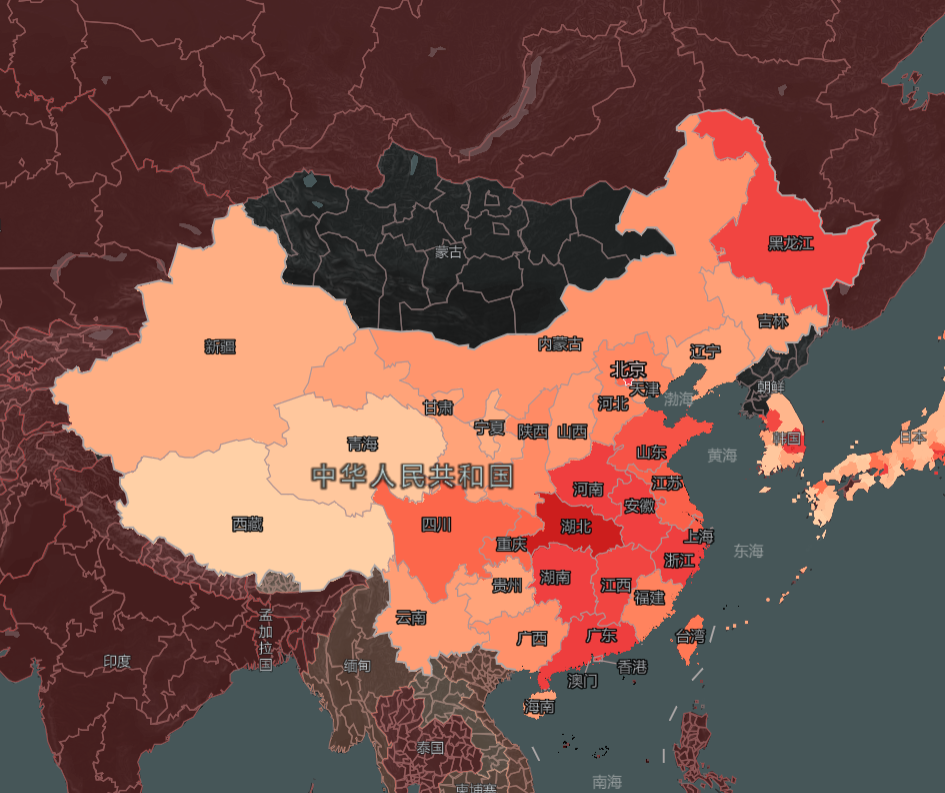
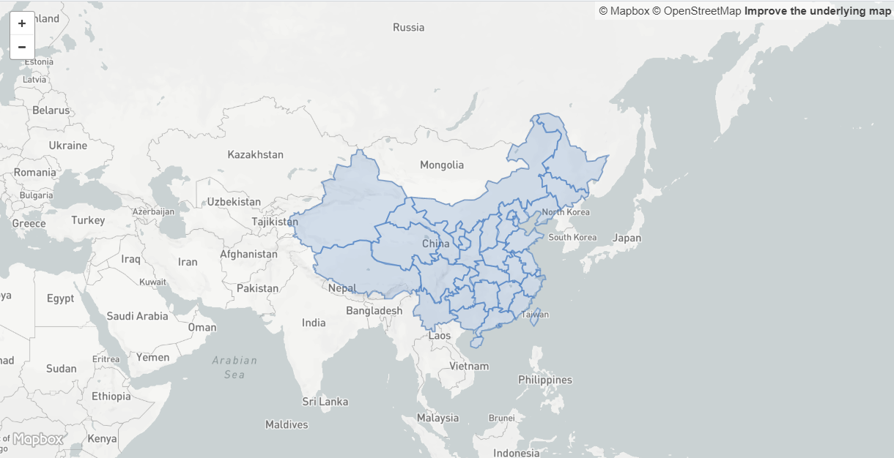
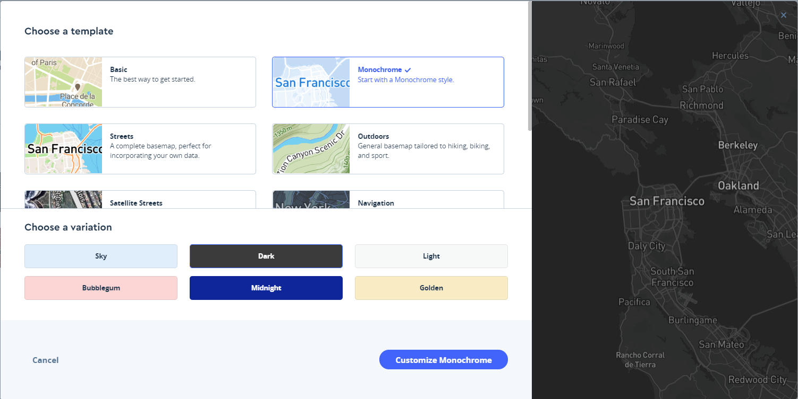
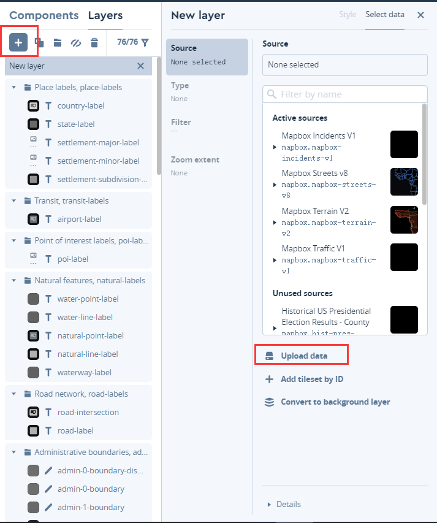
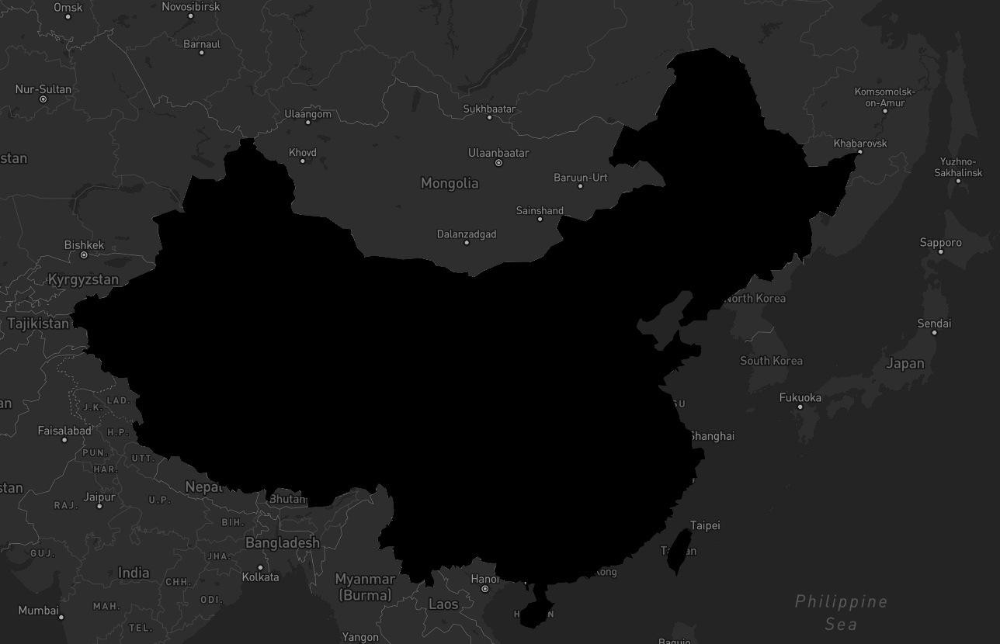
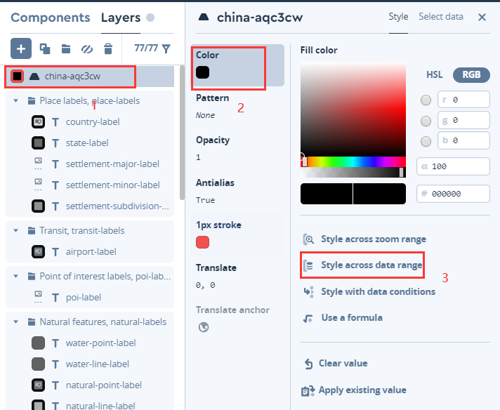
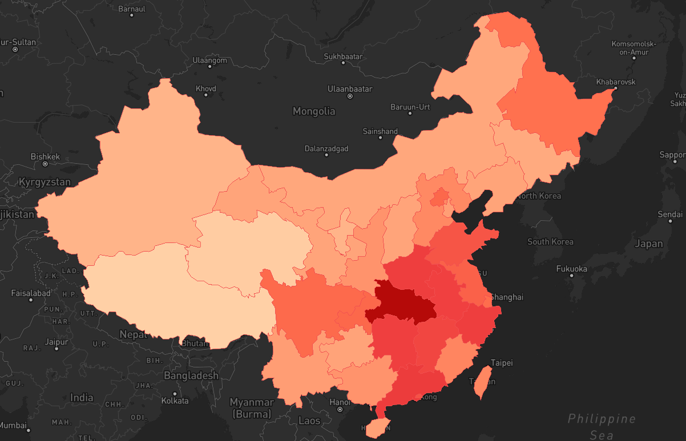
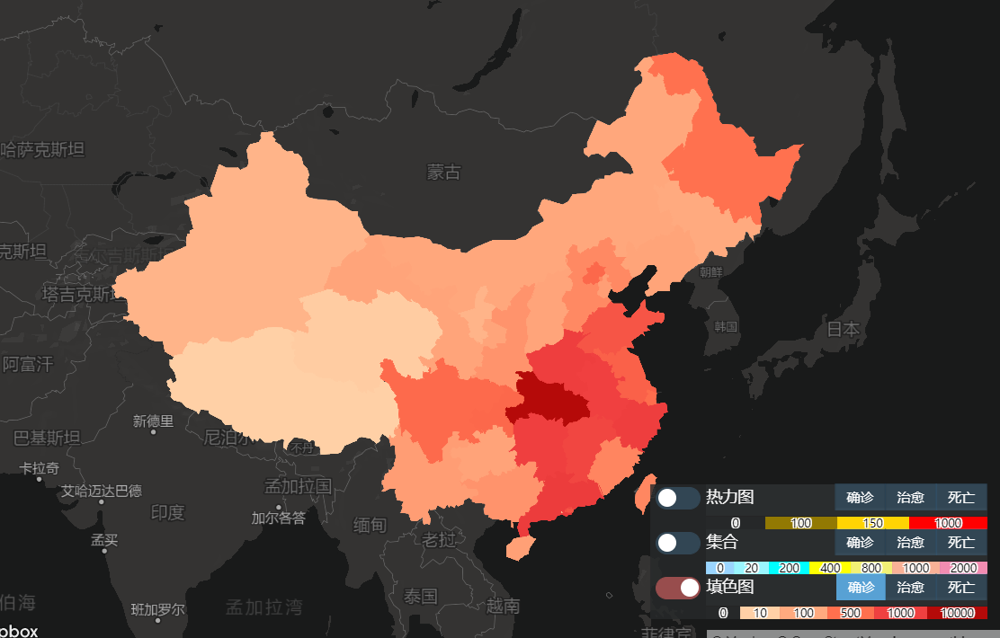

## 新冠疫情数据可视化

做了折线图（每日新增、每日治愈、每日死亡）、折线图（死亡率）、堆叠条形图（现存病例+治愈+死亡即确诊）、中国区域填色图（总确诊数目、总治愈数目、总死亡数目）、中国区域&世界区域集合图（总确诊数目、总治愈数目、总死亡数目）、中国区域&世界区域热力图（总确诊数目、总治愈数目、总死亡数目）。

## 填色图

这些天在做基于Mapbox的疫情数据可视化，在[从地图看疫情 by Mofei Zhu](https://www.zhuwenlong.com/blog/article/5e5235cd502a71323370c652)文章中看到了填色专题图，感觉很有意思，如下。

决定动手实现下。

首先，在这篇文章中，作者提到了大概思路：
> 其实在Mapbox的地图中，我们可以在Studio中上传国家、省份、洲、城市等多边形数据，然后在Style中引用这个数据图层，也可以使用我们自带的商业边界数据。同时我们的GL JS SDK 支持根据瓦片中的数据进行配色的的功能，在Mapbox中我们把它叫做Expression。

后面，经过思考和尝试，我理解到这段话其实包含了两种思路：
1. 直接在Mapbox Studio上传数据，根据属性值调整配色；
2. 添加fill图层，使用Mapbox Expression调整配色。

两种方法的难点都在于GeoJSON数据的获得。
处理步骤如下：
1. 寻找中国地图GeoJSON文件，我在[@yezongyang](https://github.com/yezongyang/china-geojson)的GitHub仓库上寻找到了该文件。

2. 添加可视化属性，本次可视化使用截止到2020-04-03日的所有确诊、治愈、死亡数据，因为本次只对省级数据进行了可视化，所以只需在数据库中按省份进行分组查询即可得到每个省份截止到2020-04-03日的所有确诊、治愈、死亡人数，接着就是常规操作，为GeoJSON properties添加这几个属性就OK，示例：
~~~
"properties": {
                "childNum": 17,
                "size": "1700",
                "name": "河南省",
                "id": "41",
                "cp": [
                    113.0668,
                    33.8818
                ],
                "confirmed": 1276,
                "deaths": 24，
                "recovery": 1270
            }
~~~
3. 保存为文件。

下面进行两种方法的实践。

## 一 Mapbox Studio

首先，打开[Mapbox Studio](https://studio.mapbox.com/)，点击**new style**：

点击Customize Monochrome进行自定义数据的上传。

点击**Upload data**即可上传自己的GeoJSON数据了。

上传成功后为纯黑色。

接着按照**确诊人数**调整颜色。

我按照以下规则进行调整：
~~~
[0, "#ffd0a6"],
[10, "#ffd0a6"],
[100, "#ffaa7f"],
[500, "#ff704e"],
[1000, "#f04040"],
[10000, "#b50a09"]
~~~
结果如下：

接着将其发布，然后在自己的Mapbox应用里引用为底图就可以了。
或者你也可以发布个空地图，然后按照流程添加填色图，最后在你的Mapbox应用里添加图层也是可以的。

## 二 添加GeoJSON图层

上面这个方法固然可以实现效果，但是动态变化难以实现，例如，我想能够快速切换显示确诊、治愈、死亡的填色图，使用第一种方法就只好发布三个图层，然后切换显示，这样效率不高。

而且，对于一些需要保密的数据，为了安全，一般也不能将其上传到地图发布的服务器上，因此，可以考虑第二种方法：在前端使用程序添加GeoJSON图层，在后端根据查询条件生成GeoJSON数据，需要数据时访问后端接口即可。前端代码如下：
~~~ js
      map.addSource("fillSourceID", {
        type: "geojson" /* geojson类型资源 */,
        data: china /* geojson数据 */
      });
      map.addLayer({
        id: "fillID",
        type: "fill" /* fill类型一般用来表示一个面，一般较大 */,
        source: "fillSourceID",

        paint: {
          "fill-color": {
            property: "confirmed", // this will be your density property form you geojson
            stops: [
              [0, "#ffd0a6"],
              [10, "#ffd0a6"],
              [100, "#ffaa7f"],
              [500, "#ff704e"],
              [1000, "#f04040"],
              [10000, "#b50a09"]
            ]
          },
          "fill-opacity": 1 /* 透明度 */
        }
      });
~~~

使用该种方式，程序员可以自由控制展示的属性、展示的颜色配置和展示数据的时间周期等，程序的可扩展性得到了很大的增强。

在本程序开发中，我也实现了图层的切换，并不复杂，在此不叙述了。

多说一句，如果想做随时间的变化的填色图，就也不得不考虑这种方式，因为发布这么多地图是很蠢的行为。采取程序的方式，即可动态的根据要求查询数据库，获得对应的GeoJSON数据，从而可视化为填色图。

@微信公众号：**古月有三木**

